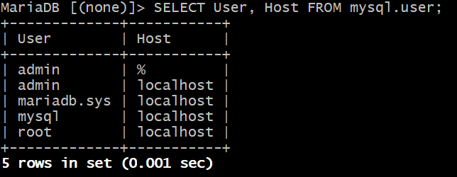

# Git
```
git init
git add .
git commit -m "Initial commit"
git branch -M main
git remote add origin https://github.com/Pomog/DevOps01
git push -u origin main
```
# Run Oracle VirtualBox on Windows
```powershall
Disable-WindowsOptionalFeature -Online -FeatureName Microsoft-Hyper-V-Hypervisor
(Get-CimInstance -ClassName Win32_ComputerSystem).HypervisorPresent
```
```
Win+R OptionalFeatures
```
- Check
    - Virtualization is enabled in BIOS.
    - Disabled: WSL2, Virtual Machine Platform, Windows Hyper-V Platform.
    - Virtualization-Based Security (VBS) services are disabled: Application Guard, Windows Sandbox, Guarded Host.
    - Check that Windows security features do not block the virtual machine.

# Vagrant 01
- using GitBash
```GitBash
pwd
```
## CentOS
- change working dir
```GitBash
mkdir centos
mkdir ubuntu
```
```GitBash
cd centos
```
- to find Vagrant Box (https://portal.cloud.hashicorp.com/vagrant/discover)
```GitBash
vagrant init eurolinux-vagrant/centos-stream-9
```
- result
```
A `Vagrantfile` has been placed in this directory. You are now
ready to `vagrant up` your first virtual environment! Please read
the comments in the Vagrantfile as well as documentation on
`vagrantup.com` for more information on using Vagrant.
```
- RUN
```GitBash
vagrant up
```
- to see downloaded boxes, status
```GitBash
vagrant box list
vagrant global-status --prune
vagrant status
vagrant ssh
vagrant halt
```
## Ubuntu
- change working dir
```GitBash
cd ubuntu
```
- to find Vagrant Box (https://portal.cloud.hashicorp.com/vagrant/discover)
```GitBash
vagrant init ubuntu/jammy64
```

## CentOS Stream is a Red Hat–based distribution that uses dnf
- System maintenance on CentOS Stream
```bash
sudo dnf upgrade --refresh -y && sudo dnf autoremove -y && sudo dnf clean all
```
- System maintenance on Ubuntu
```bash
sudo apt update -y && sudo apt full-upgrade -y && sudo apt autoremove -y && sudo apt autoclean -y
```
## Install WordPress
the ownership to the user www-data, which is potentially insecure
```bash
sudo mkdir -p /srv/www
sudo chown www-data: /srv/www
curl https://wordpress.org/latest.tar.gz | sudo -u www-data tar zx -C /srv/www
```
- Configure Apache for WordPress
```bash
vim /etc/apache2/sites-available/wordpress.conf
```
```bash
<VirtualHost *:80>
    DocumentRoot /srv/www/wordpress
    <Directory /srv/www/wordpress>
        Options FollowSymLinks
        AllowOverride Limit Options FileInfo
        DirectoryIndex index.php
        Require all granted
    </Directory>
    <Directory /srv/www/wordpress/wp-content>
        Options FollowSymLinks
        Require all granted
    </Directory>
</VirtualHost>
```
Enable the site with:
```bash
sudo a2ensite wordpress
```
Enable URL rewriting with:
```bash
sudo a2enmod rewrite
```
Disable the default “It Works” site with:
```bash
sudo a2dissite 000-default
```
```bash
sudo service apache2 reload
```
- Configure database
```bash
sudo mysql -u root
CREATE DATABASE wordpress;
CREATE USER wordpress@localhost IDENTIFIED BY '<your-password>';

GRANT SELECT,INSERT,UPDATE,DELETE,CREATE,DROP,ALTER ON wordpress.* TO wordpress@localhost;

FLUSH PRIVILEGES;
quit
```
- Configure WordPress to connect to the database
```bash
sudo -u www-data cp /srv/www/wordpress/wp-config-sample.php /srv/www/wordpress/wp-config.php
```
```bash
sudo -u www-data sed -i 's/database_name_here/wordpress/' /srv/www/wordpress/wp-config.php
sudo -u www-data sed -i 's/username_here/wordpress/' /srv/www/wordpress/wp-config.php
sudo -u www-data sed -i 's/password_here/<your-password>/' /srv/www/wordpress/wp-config.php
```
```bash
sudo -u www-data nano /srv/www/wordpress/wp-config.php
```
```
define( 'AUTH_KEY',         'put your unique phrase here' );
define( 'SECURE_AUTH_KEY',  'put your unique phrase here' );
define( 'LOGGED_IN_KEY',    'put your unique phrase here' );
define( 'NONCE_KEY',        'put your unique phrase here' );
define( 'AUTH_SALT',        'put your unique phrase here' );
define( 'SECURE_AUTH_SALT', 'put your unique phrase here' );
define( 'LOGGED_IN_SALT',   'put your unique phrase here' );
define( 'NONCE_SALT',       'put your unique phrase here' );
```
Delete those lines. Then replace with the content of https://api.wordpress.org/secret-key/1.1/salt/.

## Journald logs (systemd):
Instead of storing everything in plain-text log files, Ubuntu also uses systemd-journald to collect system logs.
You can see these logs by using the journalctl command. For example:
```bash
sudo journalctl -xe
```
Or filtering by a specific service:
```bash
sudo journalctl -u <service-name>
```

## Runlevels of SysV
- Runlevel 0: Shutdown the system.
- Runlevel 1: Single-user mode (often used for system maintenance). Only the root user is allowed, and many services (like networking) are not started.
- Runlevel 2: Multi-user mode without networking.
- Runlevel 3: Multi-user mode with networking.
- Runlevel 4: Reserved for local administration or could be customized for specific needs. In many distributions, runlevel 4 is essentially the same as runlevel 3.
- Runlevel 5: Multi-user mode with networking and with a graphical desktop environment.
- Runlevel 6: Reboot the system.

```bash
/etc/systemd/system/multi-user.target.wants/
```
- This dir is used by systemd to manage which services are started when the system reaches the multi-user target (roughly equivalent to the traditional runlevel 3 in SysV init systems)
- multi-user.target in systemd is roughly equivalent to runlevel 3 in SysV init. It starts all the necessary services for a multi-user, non-graphical environment.

## Provisioning
```
   config.vm.provision "shell", inline: <<-SHELL
     dnf update
     dnf install httpd wget unzip git -y
     mkdir /opt/devopsdir2
     free -m
   SHELL
```

## Install and configure WordPress - Ubuntu Server 20.04 LTS
- 
```bash
sudo apt update
sudo apt install apache2 \
                 ghostscript \
                 libapache2-mod-php \
                 mysql-server \
                 php \
                 php-bcmath \
                 php-curl \
                 php-imagick \
                 php-intl \
                 php-json \
                 php-mbstring \
                 php-mysql \
                 php-xml \
                 php-zip
```

## Vagrant-hostmanager
The vagrant-hostmanager plugin automates the management of your hosts file, ensuring that your virtual machines’ hostnames and IP addresses are always correctly mapped. This simplifies accessing your Vagrant environments by hostname instead of IP address, which is especially useful in multi-machine setups.

### Key Features
- Automatic Hosts File Updates:
Automatically adds or removes entries in your /etc/hosts file (or its equivalent) as VMs are started, halted, or destroyed.

- Multi-Machine Support:
Works seamlessly with environments that include multiple VMs, ensuring that all hostnames are correctly configured.

- Simplified Network Management:
Eliminates the need for manual editing of the hosts file, reducing configuration errors and saving time.

### Installation
```bash
vagrant plugin install vagrant-hostmanager
```
After installation, enable and configure the plugin within your Vagrantfile to suit your environment's needs. This setup allows for streamlined development and testing, as all your VMs are accessible by easily remembered names.

## MYSQL Setup
- Login to the db vm
```bash
vagrant ssh db01
```
- Verify Hosts entry, if entries missing update the it with IP and hostnames
```bash
cat /etc/hosts
```
- Update OS with latest patches
```bash
dnf update -y
```
- Set Repository
```bash
dnf install epel-release -y
```
- Install Maria DB Package
```bash
dnf install git mariadb-server -y
```
- Starting & enabling mariadb-server
```bash
systemctl start mariadb
systemctl enable mariadb
```
- RUN mysql secure installation script.
```bash
mysql_secure_installation
```
NOTE: Set db root password, I will be using admin123 as password

- Set DB name and users.
```bash
mysql -u root -padmin123
```
```sql
create database accounts;
grant all privileges on accounts.* TO 'admin'@'localhost' identified by
'admin123';
grant all privileges on accounts.* TO 'admin'@'%' identified by 'admin123';
FLUSH PRIVILEGES;
exit;
```

- Download Source code & Initialize Database.
```bash 
cd /tmp/
git clone -b local https://github.com/hkhcoder/vprofile-project.git
cd vprofile-project
mysql -u root -padmin123 accounts < src/main/resources/db_backup.sql
mysql -u root -padmin123 accounts
mysql> show tables;
mysql> exit;
```
- Restart mariadb-server
```bash
systemctl restart mariadb
```
- Starting the firewall and allowing the mariadb to access from port no. 3306
```bash
systemctl start firewalld
systemctl enable firewalld
firewall-cmd --get-active-zones
firewall-cmd --zone=public --add-port=3306/tcp --permanent
firewall-cmd --reload
systemctl restart mariad
```

## MEMCACHE SETUP
- Login to the Memcache vm
```bash
vagrant ssh mc01
```
- Verify Hosts entry, if entries missing update the it with IP and hostnames
```bash
cat /etc/hosts
```
- Update OS with latest patches
```bash
dnf update -y
```
- Install, start & enable memcache on port 11211
```bash
sudo dnf install epel-release -y
sudo dnf install memcached -y
sudo systemctl start memcached
sudo systemctl enable memcached
sudo systemctl status memcached
sed -i 's/127.0.0.1/0.0.0.0/g' /etc/sysconfig/memcached
sudo systemctl restart memcached
```
- Starting the firewall and allowing the port 11211 to access memcache
```bash
systemctl start firewalld
systemctl enable firewalld
firewall-cmd --add-port=11211/tcp
firewall-cmd --runtime-to-permanent
firewall-cmd --add-port=11111/udp
firewall-cmd --runtime-to-permanent
sudo memcached -p 11211 -U 11111 -u memcached -d
```

## RABBITMQ SETUP
- Login to the RabbitMQ vm
```bash
vagrant ssh rmq01
```
- Verify Hosts entry, if entries missing update the it with IP and hostnames
```bash
cat /etc/hosts
```
- Update OS with latest patches
```bash
dnf update -y
```
- Set EPEL Repository
```bash
dnf install epel-release -y
```
- Install Dependencies
```bash
sudo dnf install wget -y
dnf -y install centos-release-rabbitmq-38
dnf --enablerepo=centos-rabbitmq-38 -y install rabbitmq-server
systemctl enable --now rabbitmq-server
```
- Setup access to user test and make it admin
```bash
sudo sh -c 'echo "[{rabbit, [{loopback_users, []}]}]." > /etc/rabbitmq/rabbitmq.config'
sudo systemctl restart rabbitmq-server
sudo rabbitmqctl add_user test test
sudo rabbitmqctl set_user_tags test administrator
rabbitmqctl set_permissions -p / test ".*" ".*" ".*"
sudo systemctl restart rabbitmq-server
```
- Starting the firewall and allowing the port 5672 to access rabbitmq
```bash sudo systemctl start firewalld
sudo systemctl enable firewalld
firewall-cmd --add-port=5672/tcp
firewall-cmd --runtime-to-permanent
sudo systemctl start rabbitmq-server
sudo systemctl enable rabbitmq-server
sudo systemctl status rabbitmq-server
```

## READ
```bash
man 7 signal
```
- Signals are used to communicate between processes or between the OS and a process. They can:
✅ Stop a process
✅ Restart a process
✅ Terminate a process
✅ Tell a process to reload its configuration

```bash
man systemd
```